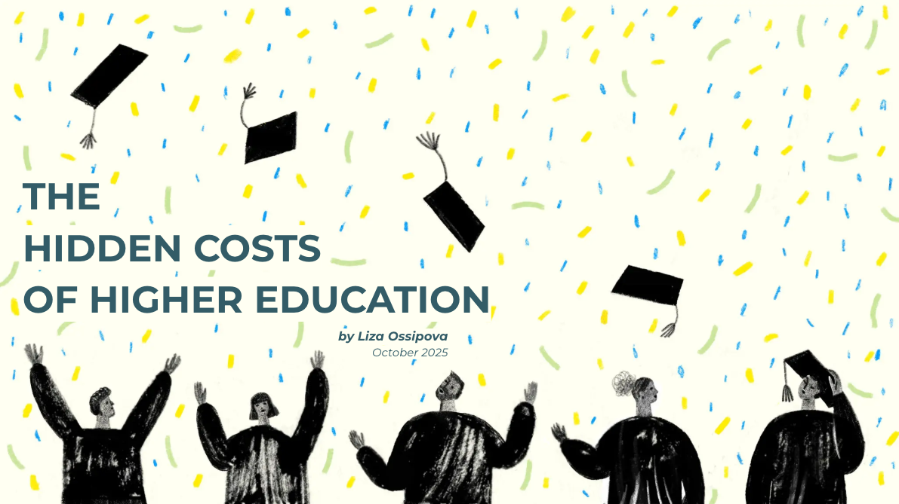
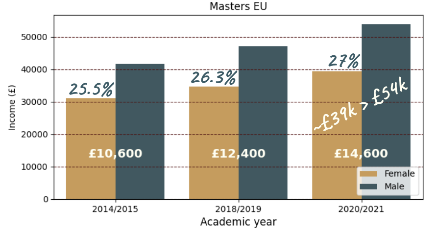

# The hidden costs of higher education

## Introduction & Goal

We’ll explore how location, gender and opportunity interact in shaping UK graduate outcomes and uncover where the system rewards, and where it fails to deliver.

### Research questions
- How has the supply of UK graduates shifted over time?
- Does access to education translate into equality?
- Do graduates have to choose between stability and higher income?
- Do qualification levels affect the gender pay gap?

## Data source

[LEO Graduate and Postgraduate Outcomes, Tax year 2022-23 (latest available)](https://explore-education-statistics.service.gov.uk/find-statistics/leo-graduate-and-postgraduate-outcomes/2022-23)

## Insights preview

## Key findings
- The system rewards education, but not equally.
- Women form the more stable workforce, yet the labour market rewards availability over commitment.
- Women now make up the majority of graduates, yet their growing presence in higher education has not translated into equal outcomes in pay.

## Detailed report

To explore the complete analysis, see [The hidden costs of higher education](presentation/the_hidden_costs_of_higher_education_allwomen_da_final_liza_ossipova.pdf)

## Tools used
- Python
- Pandas for data manipulation
- Matplotlib/Seaborn for visualisation
- Jupyter Notebooks for analysis

## Author & Acknowledgement

This exploratory data analysis was conducted by [Liza Ossipova](https://www.linkedin.com/in/lizaossipova/).

Completed in October 2025 as part of [allWomen Data Analytics Bootcamp](https://www.allwomen.tech/bootcamp/data-analytics-bootcamp/).
